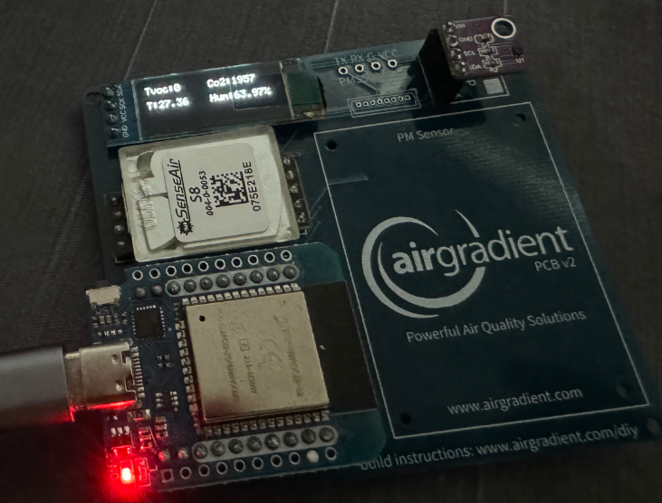
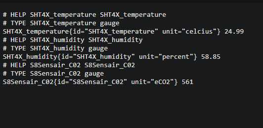
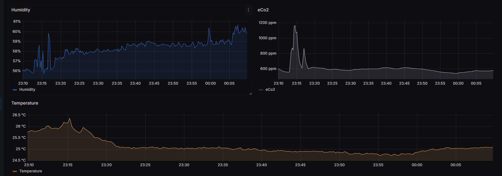

# Alternative firmware for Airgradient DIY sensor

Prototype firmware for the Airgradient DIY sensor.

## Features

- Wifi credentials can be set via a web interface
- Local IP displayed on screen
- Sensor Data exposed as prometheus format
- Sensor Data exposed on screen
- Easy customization code for your own needs

## Supported Hardware

- S8 sensor
- ESP32 (d1 mini)
- SSD1306 OLED Display
- SGP30 sensor
- SHT4x sensor

## Dependencies

Add library: `https://raw.githubusercontent.com/espressif/arduino-esp32/gh-pages/package_esp32_index.json`
- asyncTCP
- ESPAsyncWebServer
- ESPSoftwareSerial
- Adafruit GFX Library
- Adafruit SSD1306
- Adagruit SGP30

## Pictures

