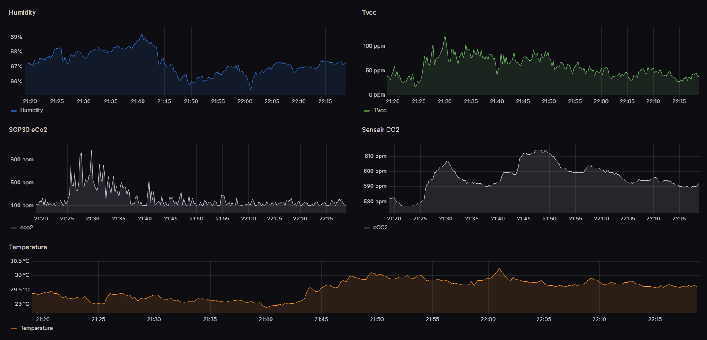

# Alternative firmware for Airgradient DIY sensor

Prototype firmware for another custom Airgradient DIY sensor, but this time, with Prometheus compatible metrics.

## Features

- Wifi credentials can be set via a web interface
- Local IP displayed on screen
- Sensor Data exposed as prometheus format
- Sensor Data exposed on screen
- Easy customization code for your own needs

## Supported Hardware

- S8sensair sensor
- ESP32 (d1 mini)
- SSD1306 OLED Display
- SGP30 sensor
- SHT4x sensor

## How to install

You can use [this custom web flasher](https://olivierargentieri.github.io/OpenAGFlasher/)

If it's your time flashing the firmware, at the end connect to the wifi network `airgradient` and set your wifi credentials via the web interface (`192.168.4.1`)

## Pictures

